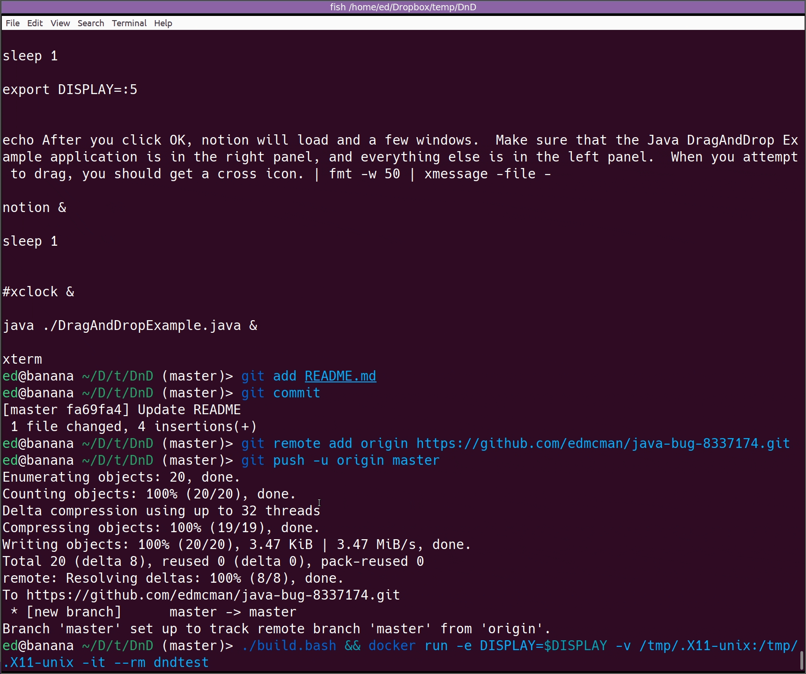

This is a small Docker image to demonstrate the problem described in [JDK bug 8337174](https://bugs.java.com/bugdatabase/view_bug?bug_id=JDK-8337174).  To run it, use the following command:

`./build.bash && docker run -e DISPLAY=$DISPLAY -v /tmp/.X11-unix:/tmp/.X11-unix -it --rm dndtest`

This should launch Xephyr, an embedded X server, and a message box should appear explaining how to continue the demo.

## Demo

